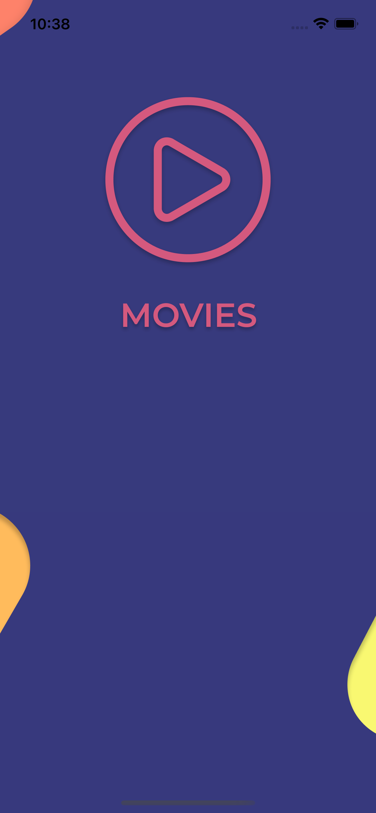
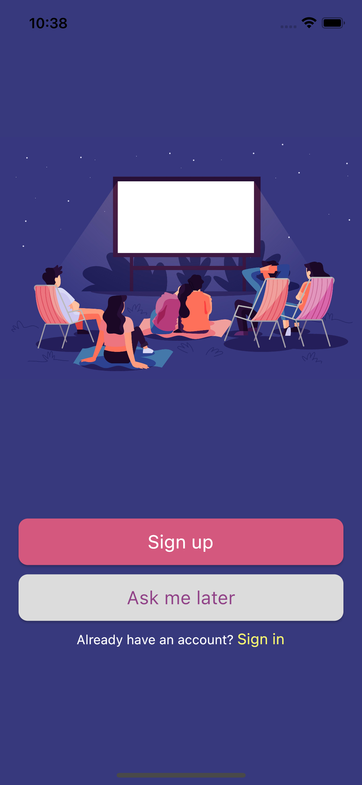
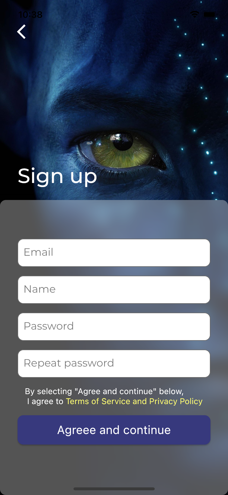
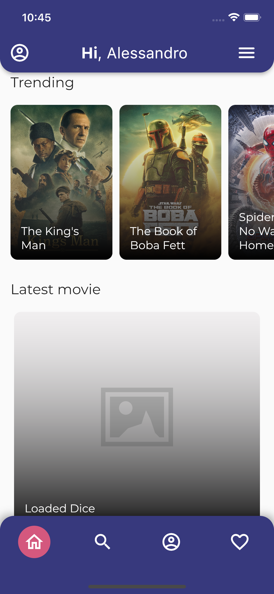
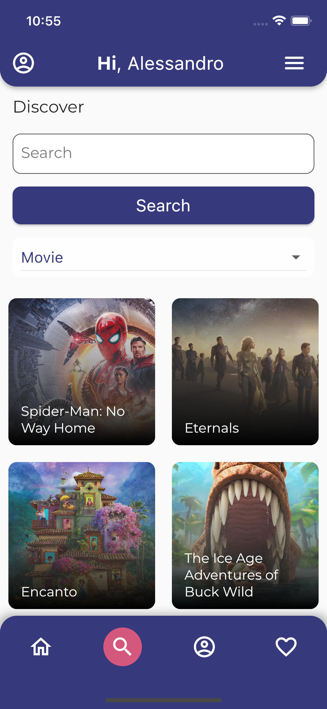
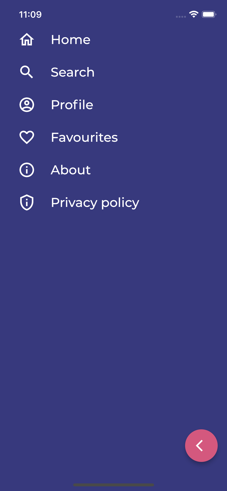
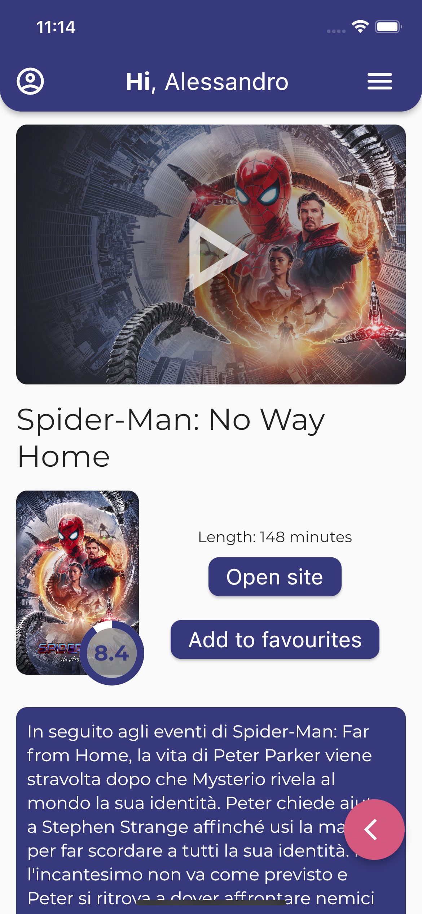

# Introduction

## Info progetto
Nome: **Alessandro Pucci**,  
Matricola: **317172**,  
Titolo: **Movies**.  

# Spiegazione
L'applicazione che ho sviluppato è una semplice app per mostrare informazioni riguardanti film, serie tv e persone.
L'idea è di poter avere una piattaforma dove poter vedere informazioni riguardanti tante opere cinematografiche, e poter anche capire quale sia il servizio di streaming da cui poterli vedere, senza dover fare ulteriori ricerche su internet.
Se disponibile infatti verrà mostrata la piattaforma di streaming in cui è presente in Italia.
  
L'utente inoltre può cercare film e metterli tra i preferiti per poterli salvare per il futuro, una sorta di watch later (questa funzione è disponibile solo previa registrazione o login).

## Casi d'uso
L'utente può entrare nell'app decidendo di registrarsi o di evitare la registrazione/login e andare direttamente alla fase di utilizzo.
L'utente quindi decide di sfogliare la homepage dove troverà film, serie tv e personaggi dello spettacolo in base ai più popoplari, o quelli in tendenza, decidendo di aprirne uno per leggere una breve descrizione o qualche trailer che è stato pubblicato.
Altrimenti se ha sentito parlare di un film da un amico può decidere di cercarlo dalla pagina ricerca e vedere qualche info e su quale piattaforma streaming potrebbe guardarlo.
In quest'ultima pagina vengono mostrati di default una serie di film suggeriti (in base a quello di cui gli utenti di tmdb parlano di più), utilizzando il dropdown si possono avere le serie tv suggerite.
  
Se l'utente al momento non ha la possibilità di vedere il film scelto, può decidere di metterlo fra i preferiti, se loggato, ed in seguito ritrovarlo alla prossima apertura dell'app.

Nella scheda del dettaglio del film scorrendo possiamo trovare i suggeriti, premendo su di uno possiamo aprire quella scheda , vi è anche la possibilità di vedere una gallery del contenuto aperto, se questo possiede immagini.
I contenuti suggeriti sono limitati a 10 elementi per evitare che la listview verticale sia troppo lunga.

## Esperienza utente
La UI presenta elementi di facile utilizzo per device mobile, come liste orizzontali e pagine a scorrimento verticale, in particolare per la UX si è pensato di creare (oltre il navbar in alto con il pulsante del menù) una bottomNavigationBar perchè più facilmente raggiungibile negli smartphone con il pollice, questa presenta i pulsanti per raggiungere le principali pagine: home, preferiti, ricerca e profilo.

Nell'appbar verticale l'utente può navigare immediatamente verso il profilo o aprire il pannello laterale dove ci sono i collegamenti a tutte le pagine.
Al centro se l'utente è loggato troverà il suo nome.

I campi per inserire gli input sono mirati ad aprire la keyboard dello smartphone con il tipo che l'app si aspetta (nel caso della mail il textfield apre la keyboard con i suggerimenti le mail già inserite in altri field della stessa tipologia e con i pulsanti della tastiera per velocizzare l'inserimento di un mail).
  
Tutti gli screenshot sono stati effettuati sul simulatore di un IPhone 13: 

Splashscreen  
  
</img>
---
Welcome page  
  
</img>
---
Signup page  
  
</img>
---
Homepage  
  
</img>
---
Search page  
  
</img>
---
Sidebar  
  
</img>
---
Details  
  
</img>

# Techs
Le tecnologie utilizzate: 
- per le APIs ho utilizzato il servizio di TMDB.com, un portale dove si possono trovare APIs per una vasta collezione di dati riguardanti film, serie tv e personaggi dello spettacolo.
Per poterle utilizzare occorre creare un account sul sito ed in seguito fare richieste autenticate con api_key o bearer token, dipendentemente da quale versione di API si intende usare.
- login/registrazione viene gestita da un hivedb consigliato da molti articoli su internet data la sua rapidità, rispetto un file json o sqflite.
- in seguito al login/registrazione si possono sfruttare le funzionalità dei preferiti.
- internamente lo scaffolding dell'app nella folder lib è stato effettuato seguendo la struttura che di norma utilizzo nel mio lavoro dove utilizzo React, varie folder con i componenti grafici, quindi sempre dentro la root ci saranno folder in cui si possono trovare costanti, utilities che possono essere usate in più parti del codice (come i mapper) e models che utilizzo all'interno del progetto. Questo rende il codice più leggibile e più prevedibile, perchè lo sviluppatore se dovesse tornare sul codice per nuove feature o per bugfix, sa già cosa aspettarsi da un oggetto.
- per salvare e cachare le risorse ricevute dalle api e le informazioni riguardanti l'utente ho deciso di sfruttare __HiveDB__ invece di un file JSON o sqflite viste le performance e la facilità d'utilizzo.
- un altro pacchetto utilizzato è __provider__, che è servito a poter centralizzare gli stati e i metodi che li aggiornano, per riutilizzarli poi nei vari widget che sfruttano i dati degli stati e i loro cambiamenti. Ho creato in tutto 5 providers, quindi ho utilizzato MultiProviders per poterli gestire al meglio.
I providers sono stati divisi in base alle sezioni che li utilizzano.
- per gestire i link che escono dall'app come quelli verso youtube o verso siti esterni ho usato __url_launcher__.
- __percent_indicator__ è stato installato per poter creare un indicatore grafico per il voto globale ricevuto dal film o serie tv.
- __device_info_plus__ mi è servito per individuare le informazioni riguardanti il device che esegue l'app ed usarle per adattare l'interfaccia grafica (ho notato che i device Apple che dispongono del notch tendono ad avere la bottom navigation bar e l'app bar più pronunciate, rendendo la parte utilizzabile di schermo più piccola e di conseguenza alcuni titoli potevano risultate oscurati).

Come mostrato nel file pubspec.yml i restanti pacchetti esterni usati sono tmdb_api e flutter_icons, il primo per poter sfruttare al meglio le APIs di tmdb, invece di dover seguire la libreria standard di flutter (http), che mostrava problemi di configurazioni con le APIs di tmdb, il secondo invece è stato sfruttato per creare l'icona dell'app.

Non ho disinstallato il pacchetto cached_network_image perchè negli ultimi giorni avrei voluto provare ad utilizzarlo per rendere il caricamento delle immagini più rapido dopo il primo accesso, perchè passando da una pagina ad un'altra queste informazioni devono essere riprese dall'app e questo comporta un largo utilizzo di dati da parte del dispositivo e per l'utente un tempo più elevato per vedere le immagini (rovina l'esperienza utente).

## Tests
Tutti i test sono stati effettuati su Oneplus 5T con Android 10 e su iPhone 13 con iOS 15.2.
Sono stati effettuati test con un iPhone 6 plus (purtroppo non ho controllato la versione del sistema operativo), con risultati negativi perchè dopo il caricamente della homepage il dispositivo non sembrava riuscire a "reggere" l'app e la chiudeva dopo pochi secondi dal caricamento dei dati. Da Macbook Pro purtroppo non ho potuto effettuare test su un simulatore di un iPhone 6 plus perchè non più presente.

## Unintentional behaviour
Riguardo la funzionalità dei suggeriti, questa purtroppo induce un comportamento non corretto da parte dell'app, che non permette di aprire il side panel dopo l'apertura del primo suggerito.
Gli unici modi di poter tornare al corretto lifcycle dell'app è di tornare indietro fino ad uscire dai suggeriti, tramite il floating button o le gesture del dispositivo native.

In caso di rilascio reale questo bug dovrebbe avere la priorità perchè è il più "pericoloso."